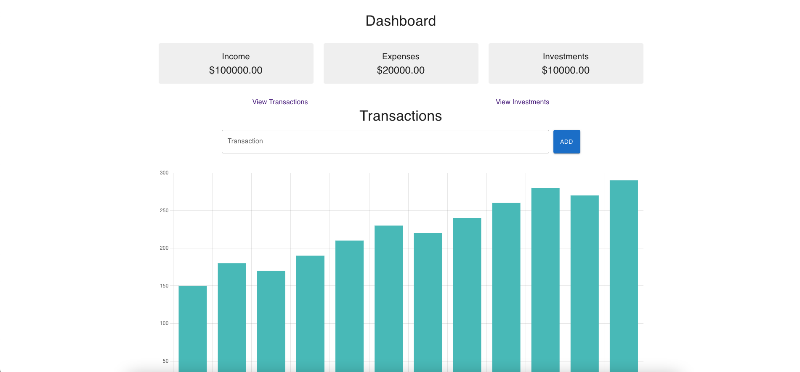
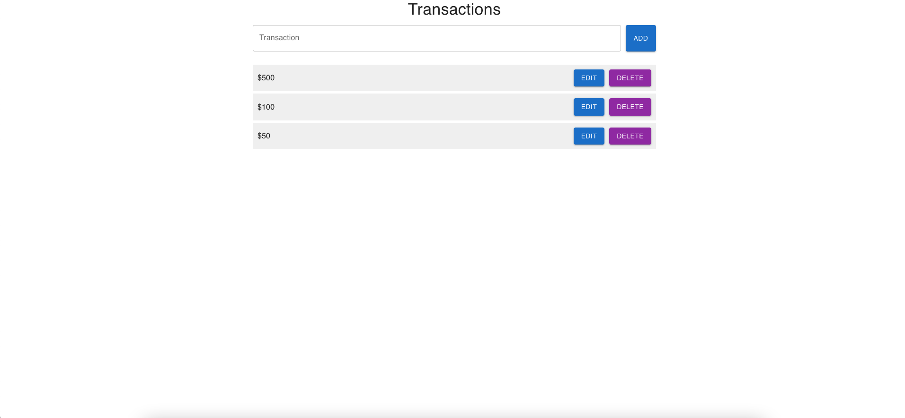

# Personal Finance Tracker

A simple personal finance tracker web application built using React.js, Firebase, and Material-UI.

## Features

- Dashboard with an overview of income, expenses, and investments
- Transactions list and management
- Investment tracking
- User authentication and registration
- Responsive design

# Technologies

- React.js
- Firebase(Authentication and Firestore)
- Material-UI

# Getting Started

## Prerequisites

- Node.js (latest LTS version recommended)
- A Firebase account with a new or existing project

## Setup and Installation

1. Clone the repository:

git clone https://github.com/SomarGuy/personal-finance-dashboard

2. Navigate to the project directory:

cd personal-finance-dashboard

3. Install the required dependencies:

npm install

4. Set up Firebase:

- Go to the [Firebase console](https://console.firebase.google.com/) and create a new project.
- Enable the Firestore and Email/Password authentication for your project.
- Navigate to the "Project settings" page, and copy the Firebase configuration object.

5. Configure Firebase in the project:

- Open the `src/firebase.js` file.
- Replace the `firebaseConfig` object with your Firebase project configuration.

6. Start the development server:

npm start

7. Open your browser and navigate to [http://localhost:3000](http://localhost:3000) to view the application.

## Contributing

Pull requests are welcome. For major changes, please open an issue first to discuss what you would like to change.

## License

[MIT](https://choosealicense.com/licenses/mit/)
